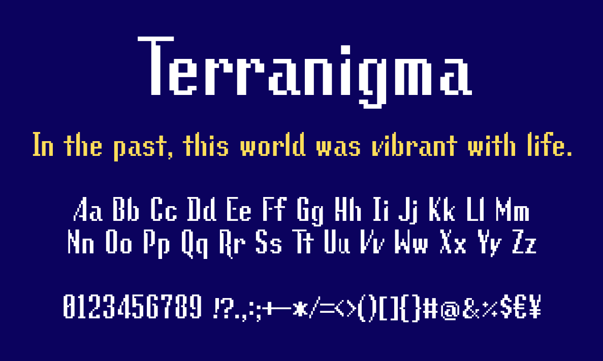

# Magirock

## About this font

This font is a remake of the original Terranigma font featuring variable glyph width, kerning and other improvements.

It was made using [YAL's Pixel Font Converter](https://yal.cc/tools/pixel-font/).

## Usage

Download the font file at https://github.com/Calabiyaur/Magirock/releases/latest.

